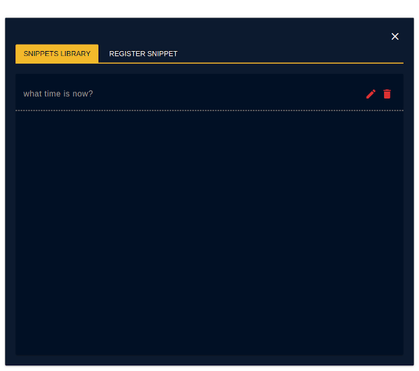
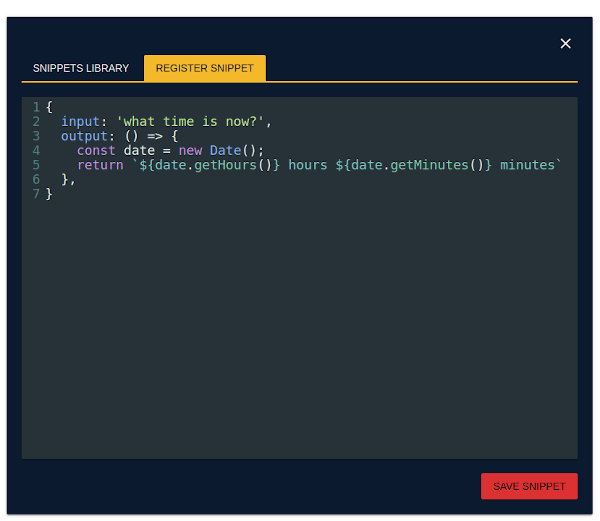

# ScarlettSays

ScarlettSays is a simple voice assistant's playground for the development purposes. It uses the browser speech recognition modules and shows how it can be used for making your own simple voice assistant. You can set various unique snippets through your own logic and expect a feedback from assistant. Assistant can be set by using the simple JavaScript-based syntax.

## Getting Started With Project

### Installation And Running

Just clone that repository and run `npm install` to install dependency. After that you could start it by using `npm start`. There is no production mode. Development server is used to save, load, update snippets.

### Wake Up Your Dev Assistant

When you start the web-application, by default invocation command is `Scarlett`. For some reason, it is a really difficult-to-understand name for the computer microphone and you should have the microphone with good sensivity for comfortable using of it. However, you can always change it through `config.json` in the root directory and pick any prefered name or word.

### Interface

User Interface has four buttons to provide management of the voice assistant's state.

| Button                                         | Functionality                                                     |
|------------------------------------------------|-------------------------------------------------------------------|
|      | Manually invokes voice assistant                                  |
|     | Stops listening the user microphone and do nothing                |
|          | Mutes voice assistant and respond only as a message on the screen |
|  | Opens snippets' management section                                |

## Create Your Own Snippet

The new snippet can be created through the snippets' management section. It has the two modes - `Snippets Library` to see, edit, remove the existing snippets and `Register Snippet` to create a new one.

 

To register the new snippet you should create a JavaScript Object with property `input` and method `output` where `output` should return string which will be used as voice assistant's feedback.

The simplest example is the snippet about the current time.

```JavaScript
SCARLETT.registerSnippet({
  input: 'what time is now?',
  output: () => {
    const date = new Date();
    return `${date.getHours()} hours ${date.getMinutes()} minutes`
  },
})
```

The property `input` is a `string` to trigger snippet. You can pass a variable by adding `*` before the keyword and, for example, `input` as `tell me about *search` can be triggered by saying `tell me about cats`, `tell me about dogs`, etc.

There is no restrictions about complexity for the method `output` if it returns the valid `string`. You can call external API with `GET` and `POST` methods to retrieve information by using `SCARLETT.httpGet` and `SCARLETT.httpPost` where `httpGet` and `httpPost` are wrappers on AngularJS service's methods `$http.get` and `$http.post`. Documentation about the methods can be found [here](https://docs.angularjs.org/api/ng/service/$http#get).

For example, the next example shows how to get the data from Wikipedia, format it by taking only the first sentences and return to the voice assistant.

```JavaScript
SCARLETT.registerSnippet({
  input: 'tell me about *search',
  output: (search) => SCARLETT.httpGet(`https://en.wikipedia.org/w/api.php?action=query&list=search&srsearch=${search}&utf8=&format=json&origin=*`)
    .then(response => {
      const id = response.data.query.search[0].pageid;
      return SCARLETT.httpGet(`https://en.wikipedia.org/w/api.php?action=query&format=json&pageids=${id}&prop=extracts&exintro&explaintext&origin=*`)
        .then(response => {
          const extraction = response.data.query.pages[id].extract;
          const snippet = extraction.substring(0, 1000).split('. ').slice(0, -1).join('. ') + '.';
          return snippet;
        })
    })
})
```
